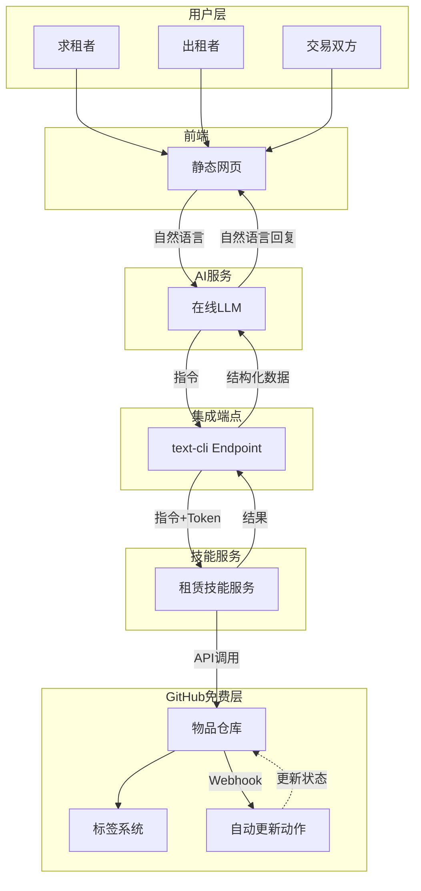
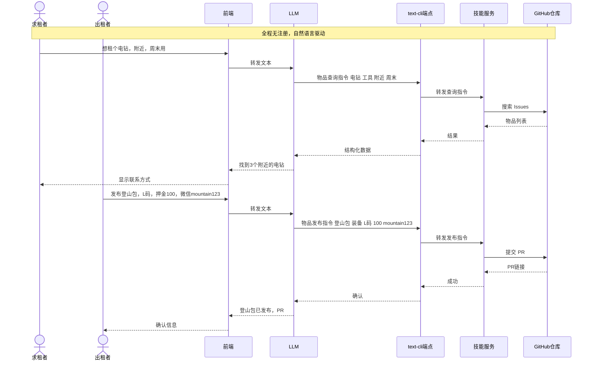
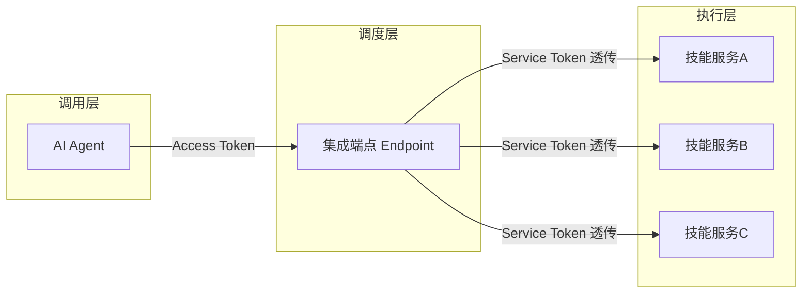

# 开源租赁平台 · 技术方案

> **版本**：v1.0  
> **状态**：草案  
> **基于**：Cloudflare Free + GitHub Free + text-cli + LLM

---

## 一、概述

### 1.1 项目背景

世界上有大量闲置物品，同时有很多人短期需要某些物品。我们希望构建一个**完全去中心化、零成本、无需注册**的租赁平台。任何人用一句自然语言就能发布闲置物品或寻找所需，所有信息公开存储在 GitHub 上，每一笔交易透明可查。

### 1.2 核心理念

- **零成本运营** – 全部基于 Cloudflare 免费边缘计算和 GitHub 免费仓库。
- **无需注册** – 出租者通过 PR 发布物品，联系方式直接写在 PR 正文中。
- **AI 原生交互** – 用户输入自然语言，AI 将其翻译为 `text-cli` 指令，自动完成操作。
- **万物可租** – 不限于房屋，工具、书籍、空间、技能时间等均可。
- **去中心化社区** – 任何组织或个人都可部署自己的端点，形成独立且可互通的租赁网络。
- **完全透明** – 所有物品和交易记录以 Issue/PR 形式公开，可审计可追溯。

### 1.3 适用场景

- 校园/社区闲置物品共享（教材、电器、运动装备）
- 城市邻里工具租借（电钻、梯子、露营设备）
- 兴趣社群器材交换（相机、乐器、无人机）
- 技能时间出租（陪练、维修指导）

---

## 二、系统架构

### 2.1 架构总览

整个平台由四个部分构成：**前端界面**、**text-cli 集成端点**、**LLM Agent**、**GitHub 作为数据层**。所有组件均运行在免费服务上。



### 2.2 典型流程

以“租用电钻”为例，展示从用户输入到获得结果的全过程（图中使用无特殊字符的占位描述，真实指令格式见备注）。



> **真实 text-cli 指令格式**  
> 图中占位描述对应的实际指令遵循 `指令:领域;动作,参数1,参数2,...` 规范：  
> - 查询指令：`指令:租赁;物品查询,电钻,工具,附近,周末`  
> - 发布指令：`指令:租赁;物品发布,登山包,装备,L码,100,mountain123`  
> - 交易指令：`指令:租赁;交易记录,42,2周`

---

## 三、核心组件详细设计

### 3.1 text-cli 集成端点

`text-cli` 是整个平台的调度核心，负责接收 AI 生成的指令，鉴权、解析、路由并转发给对应的技能服务。

#### 3.1.1 官方项目

> 项目地址：[https://github.com/weihai-limh/text-cli](https://github.com/weihai-limh/text-cli)

text-cli 是一个文本驱动的技能市场框架，定义了一套统一的指令协议和端点规范。任何人都可以部署自己的端点，并将不同的经验技能封装为独立的服务接入。

#### 3.1.2 双层端点架构



- **集成端点**：负责 Access Token 鉴权、指令解析、路由匹配、请求转发、记账。只做转发，不执行业务逻辑。
- **技能服务**：独立部署的后端服务，接收端点转发的指令，执行实际业务操作（如调用 GitHub API）。

#### 3.1.3 指令格式

全部请求统一为 `POST /cli/text_cli`，Body 中携带 `prompt` 字段：

```json
{ "prompt": "指令:租赁;物品查询,电钻,工具,附近,周末" }
```

格式规范（SPEC v1.0）：
- 领域与动作用英文分号 `;` 分隔
- 参数用英文逗号 `,` 分隔
- 参数数量上限 10 个，指令总长 ≤ 512 字符
- 前后空白自动 trim

端点解析 `prompt` 后提取 `domain`、`action`、`params`，再通过内部路由表映射到对应的技能服务 URL。

#### 3.1.4 双层 Token 鉴权

| Token 类型 | 作用 | 存储与处理 |
|---|---|---|
| Access Token | 调用方是否有权使用端点 | 端点存储 SHA256 哈希，校验后放行或拒绝 |
| Service Token | 业务方识别与计费 | 端点不存储，原样透传给技能服务 |

安全性：
- Access Token 校验失败返回 401
- 内置令牌桶限流（60 秒滑动窗口）
- 日志记录仅保留 Token 前 8 位 + `***`
- 端点代码默认不透传 Access Token 到后端

#### 3.1.5 内部路由 Schema

端点内部维护两份 Schema：

- **内部路由表**（仅运营者可见）：`directive -> 后端 URL`
- **对外 Schema**（`GET /text_cli_schema.json`）：URL 统一替换为端点自身地址，对外隐藏技能服务细节

#### 3.1.6 调用记账

每次调用均记录至 SQLite（Python 版）或 D1（Workers 版），关键表：

- `call_logs`：request_id, directive, domain, action, status_code, response_time_ms
- `daily_stats`：按日聚合的调用量和成功率
- `access_tokens`：token_hash, quota, used_count

#### 3.1.7 部署选项

| | Python（FastAPI） | Cloudflare Workers |
|---|---|---|
| 数据库 | SQLite | D1 |
| 部署 | Docker Compose 一键启动 | `wrangler deploy` |
| 适用 | 自建 VM / 本地 | 边缘网络，零维护 |
| 状态 | 已发布 | 已发布 |

推荐项目使用 **Workers 版**，享受免费额度且无需运维。

### 3.2 LLM Agent

LLM 负责将用户的自然语言转换为 `text-cli` 指令。

#### 3.2.1 工作模式

前端将用户输入文本直接转发给 LLM，LLM 根据系统提示词输出符合格式的指令文本，再 POST 给 text-cli 端点。

#### 3.2.2 系统提示词（核心片段）

```text
你是一个物品租赁平台的意图理解助手。
用户会用自然语言描述想出租或求租的物品。
你需要输出一条 text-cli 指令，格式为：
指令:租赁;动作,参数1,参数2,...

可用动作：
- 物品查询: 参数依次为 物品名称,类别,位置,时间要求
- 物品发布: 参数依次为 物品名称,类别,押金,联系方式
- 交易记录: 参数依次为 关联PR编号,租期

如果是查询，类别未知可填“其他”，位置时间未知可填“不限”。
如果是发布，联系方式直接使用用户提供的电话或社交账号。
输出只有一条指令，不要多余解释。
```

#### 3.2.3 模型选择

任何兼容 Chat Completions API 的模型均可，推荐：

| 模型 | 特点 | 费用 |
|------|------|------|
| DeepSeek-Chat | 中文优秀，便宜 | 极低（百万 token 约 ¥1） |
| GPT-4o-mini | 速度极快 | 有免费额度或极低 |
| Groq (Llama 3) | 免费，速率限制 | 免费 |
| 本地 LLaMA.cpp | 完全离线 | 需要自己提供算力 |

前端环境变量中配置 `LLM_API_BASE` 和 `LLM_API_KEY` 即可。

### 3.3 租赁技能服务

这是一个独立部署的服务，接收 text-cli 端点转发的指令，执行真实的 GitHub 操作。

#### 3.3.1 接口设计

技能服务暴露一个 HTTP 端点（如 `POST /skill/rent`），接收与 text-cli 端点相同的 `prompt` 格式，同时从 Header 中获取透传的 `Service-Token`。

内部逻辑：
- 解析 `prompt` 中的领域和动作
- 根据动作调用 GitHub API
- 返回结果 `{"rst_types":"text","rst_data":{"text":"结果描述"}}`

#### 3.3.2 与 GitHub 的交互

| 动作 | GitHub API | 说明 |
|---|---|---|
| 物品查询 | `GET /search/issues?q=label:可租+{关键词}` | 返回匹配的 Issue 列表 |
| 物品发布 | `POST /repos/{owner}/{repo}/pulls` | 创建 PR，标题含 `[出租]`，内容为物品信息和联系方式 |
| 交易记录 | `POST /repos/{owner}/{repo}/issues` | 创建 Issue，标题 `[交易]`，写明关联 PR 和租期，打标签“交易中” |
| 浏览全部 | `GET /repos/{owner}/{repo}/issues?labels=可租` | 分页返回所有可租物品 |

所有操作使用一个具有 `repo` 权限的 Fine-grained Personal Access Token（仅授权指定仓库）。

#### 3.3.3 示例响应

```json
{
  "rst_types": "text",
  "rst_data": {
    "text": "发布成功，PR #42，点击查看：https://github.com/xxx/pull/42"
  }
}
```

### 3.4 前端界面

一个单页静态应用（可使用 Vue/React 或纯 HTML），部署在 Cloudflare Pages。

#### 3.4.1 核心功能

- 聊天式输入框：用户输入自然语言需求。
- 结果展示区：以卡片形式展示物品列表（名称、类别、位置、联系方式）。
- 物品浏览页：按分类标签筛选，展示所有可租物品。
- 部署简单：绑定 GitHub 仓库，保存时自动构建。

#### 3.4.2 与 LLM 和 text-cli 的交互

```
用户输入 → fetch(LLM_API) → 返回指令文本 → 
fetch(text-cli端点, {body:{prompt: 指令文本}}) → 
返回结果 → 格式化显示
```

所有敏感 Key 通过 Cloudflare Pages 的环境变量注入，不提交至仓库。

### 3.5 GitHub 资源组织

#### 3.5.1 仓库结构

```
/
├── .github/
│   ├── workflows/
│   │   └── item-status.yml   # 自动更新标签
│   └── ISSUE_TEMPLATE/
│       ├── rent_item.md      # 出租物品模板
│       └── trade_record.md   # 交易记录模板
├── frontend/                 # Pages 前端
├── skill/                    # 技能服务代码
├── docs/                     # 文档
└── README.md
```

#### 3.5.2 Issue/PR 数据模型

**出租物品 (PR)**：

```
---
title: "[出租] 登山包"
labels: ["可租", "装备"]
---

物品名称：登山包
类别：装备
尺寸：L码
押金：100元
可用时段：周末
联系方式：微信 mountain123
```

**交易记录 (Issue)**：

```
---
title: "[交易] 登山包 #42"
labels: ["交易中"]
---

关联PR：#42
租用方联系方式：微信 renter001
租期：2026-05-10 ~ 2026-05-17
费用：免费/押金100
```

#### 3.5.3 标签体系

| 标签 | 含义 |
|------|------|
| `可租` | 物品当前可租用 |
| `已租` | 已租出 |
| `交易中` | 正在进行交易流程 |
| `工具` / `书籍` / `空间` / `装备` / `其他` | 物品分类 |
| `免费` / `付费` | 收费标记 |

#### 3.5.4 GitHub Actions 自动化

`item-status.yml` 监听 Issue 事件：

```yaml
on:
  issues:
    types: [opened]

jobs:
  update-item:
    runs-on: ubuntu-latest
    steps:
      - uses: actions/github-script@v7
        with:
          script: |
            const body = context.payload.issue.body;
            const prMatch = body.match(/#(\d+)/);
            if (prMatch) {
              const prNum = prMatch[1];
              github.rest.issues.removeLabel({
                owner, repo, issue_number: prNum, name: '可租'
              });
              github.rest.issues.addLabels({
                owner, repo, issue_number: prNum, labels: ['已租']
              });
            }
```

交易 Issue 创建后，关联的 PR 自动从“可租”变为“已租”。归还后手动关闭 Issue 可触发逆向流程（可租恢复）。

---

## 四、部署方案

### 4.1 部署步骤

1. **Fork 本方案仓库**，获取前端、技能服务、Actions 模板。
2. **部署 text-cli 集成端点**：  
   - Workers 版：使用 `wrangler deploy`，创建 D1 数据库，配置环境变量。  
   - 或 Docker 版：`docker compose up -d`，暴露端口。
3. **注册并部署技能服务**（可在同一 Workers 或独立容器）。  
4. **配置 LLM API**：申请 DeepSeek/Groq 等 API Key，设置到前端环境变量。  
5. **绑定 Cloudflare Pages**：关联 GitHub 仓库，部署前端。  
6. **配置 GitHub 仓库**：添加 Labels，启用 Actions 权限，创建 Fine-grained Token 并填入技能服务环境变量。
7. **测试**：在前端输入“想租个电钻”，检查是否能返回测试数据。

### 4.2 免费额度估算

| 服务 | 免费配额 | 初期用量估算 |
|------|----------|--------------|
| Cloudflare Workers | 100,000 请求/日 | < 5,000/日 |
| Cloudflare Pages | 无限静态请求 | 极低 |
| GitHub Actions | 2,000 分钟/月 | < 500 分钟/月 |
| GitHub REST API | 5,000 次/小时 | < 500 次/小时 |
| LLM API (Groq) | 免费速率 | 满足中小社区 |

完全在免费额度内运行，适合长期运营。

---

## 五、安全与隐私

### 5.1 用户身份

- 平台不实现用户注册和登录，不存储任何用户凭证。
- 出租者身份通过 PR 中预留的联系方式（微信/电话）识别，求租者直接线下沟通。

### 5.2 Token 安全

- Access Token（用于端点）采用 SHA256 哈希存储，日志脱敏。
- Service Token（业务鉴权）由社区内部自行约定，端点不保存，避免泄露。
- GitHub Token 存储在技能服务的环境变量中，仅授予单仓库最低必要权限。

### 5.3 防滥用

- text-cli 端点内置限流（令牌桶，可配置）。
- 可在端点层配置 `ACCESS_TOKEN_REQUIRED=true` 强制要求调用方持有有效 Token。
- GitHub 仓库自身有 API 速率限制，防止恶意爬取。

### 5.4 数据隐私

所有交易信息公开是平台的设计初衷（透明共享），但联系方式的公开取决于发布者意愿。可通过 PR 模板提示用户使用临时联系方式或社交账号，不强制手机号。

---

## 六、扩展性与未来方向

- **多语言前端**：同一套指令协议可支持不同语言界面。
- **更多物品类型**：添加“技能服务”、“时间租借”等指令动作。
- **联邦端点**：不同社区的端点可通过统一协议互通，形成一个更大共享网络。
- **评价体系**：基于 Issue 评论构建分布式声誉系统（完全公开，非中心化存储）。
- **定时下架**：GitHub Actions 检查过期 PR 自动清除旧物品。

---

## 七、实施路线图

### Phase 1：核心原型（1-2 周）

- [ ] 搭建 GitHub 仓库及模板、Labels。
- [ ] 部署 text-cli 集成端点（Workers 版）。
- [ ] 开发技能服务 v0.1（物品查询、发布）。
- [ ] 前端聊天界面。
- [ ] 接入 LLM 并完成端到端联调。

### Phase 2：功能完善（3-4 周）

- [ ] 实现交易记录与 Webhook 自动状态更新。
- [ ] 完善物品浏览与分类筛选。
- [ ] 编写用户手册与部署文档。
- [ ] 社区内测。

### Phase 3：推广与社区培育（持续）

- [ ] 开源发布，撰写介绍文章。
- [ ] 提供一键部署脚本（含 Workers 和 Docker）。
- [ ] 鼓励社区部署自己的端点，形成去中心化网络。
- [ ] 持续收集反馈，优化 LLM 提示词和技能服务。

---

## 附录 A：环境变量参考

| 变量 | 说明 | 必填 |
|------|------|------|
| `LLM_API_BASE` | LLM API 地址 | 是 |
| `LLM_API_KEY` | LLM API 密钥 | 是 |
| `TEXT_CLI_ENDPOINT` | text-cli 端点 URL | 是 |
| `ACCESS_TOKEN` | 端点分配的 Access Token | 是 |
| `SERVICE_TOKEN` | 与技能服务约定的 Service Token | 否 |
| `GITHUB_TOKEN` | 技能服务使用的 GitHub Token | 是（技能服务） |
| `GITHUB_OWNER` | 仓库所有者 | 是（技能服务） |
| `GITHUB_REPO` | 仓库名 | 是（技能服务） |

---

> **本技术方案完全基于开放、免费的生态构建。你只需部署端点 + 接入一个大语言模型，就能运营一个属于你自己的租赁社区。让共享变得简单，从一行指令开始。**