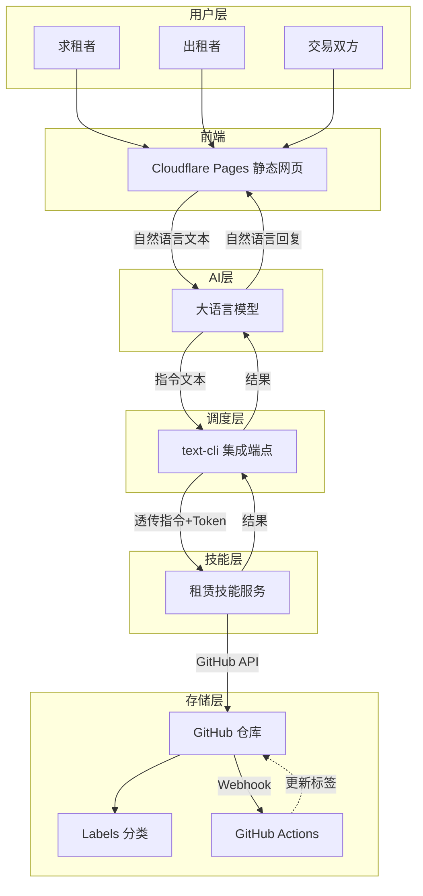

# 开源租赁平台 · 项目种子文件

> **面向受众**：人类开发者 & AI/Agent  
> **用途**：快速理解项目全景、核心规范、代码结构，以便参与开发或部署自己的端点。

---

## 1. 项目元信息

```yaml
project:
  name: "开源租赁平台"
  slug: "free-rental-platform"
  tagline: "一句话发布闲置，一句话租到万物——零成本、无注册、去中心化"
  license: "MIT"
  repository: "https://github.com/your-org/free-rental-platform"
  text_cli_repo: "https://github.com/weihai-limh/text-cli"
  architecture: "Cloudflare Workers + GitHub + AI"
  status: "early-stage"
  core_values:
    - "完全、零费用"
    - "无需用户注册，PR自带联系方式"
    - "自然语言驱动，AI自动生成指令"
    - "去中心化：任何人可部署自己的社区端点"
    - "全透明：所有数据公开在GitHub上"
```

---

## 2. 系统架构速览



---

## 3. 核心概念与术语表

| 术语 | 定义 |
|------|------|
| **被租物品** | 所有可出租的东西：工具、书籍、空间、技能时间等，不再是狭义的“房源”。 |
| **text-cli** | 一个“文本驱动的技能市场”框架，定义了统一的指令协议和端点规范，将AI生成的指令路由到不同技能服务。 |
| **集成端点 (Endpoint)** | text-cli 的调度核心，负责鉴权、解析指令、路由转发、记账。本身不做业务。 |
| **技能服务 (Skill Service)** | 独立部署的后端服务，实际执行某个领域的操作（如调用 GitHub API）。本项目提供一个“租赁技能服务”。 |
| **指令 (Directive)** | 一种人机共读的文本函数，格式 `指令:领域;动作,参数,...`，是AI和技能服务之间的通用语言。 |
| **Access Token** | 调用方（AI Agent）使用端点的凭证，端点侧校验并扣减额度。 |
| **Service Token** | 调用方与技能服务私下约定的业务凭证，端点不解析、不存储，仅透明转发。 |
| **PR 即注册** | 出租者发布物品时，技能服务会创建一个 GitHub Pull Request，其中包含了物品信息和发布者的联系方式，因此无需平台注册账号。 |
| **Issue 即交易** | 交易发生时，技能服务创建 Issue 记录交易，并触发 Webhook 自动更新物品状态。 |

---

## 4. 核心协议：指令格式

### 4.1 语法

```
指令:<领域>;<动作>,<参数1>,<参数2>,<参数3>...
```

- 领域与动作之间用英文分号 `;` 分隔。
- 动作与参数之间、参数与参数之间用英文逗号 `,` 分隔。
- 参数前后空白自动忽略。
- 指令总长度 ≤ 512 字符。
- 参数数量 ≤ 10。

### 4.2 租赁领域定义的指令

| 动作 | 参数顺序 | 示例 | 描述 |
|------|-----------|------|------|
| `物品查询` | 物品名称, 类别, 位置, 时间要求 | `指令:租赁;物品查询,电钻,工具,附近,周末` | 搜索可租物品 |
| `物品发布` | 物品名称, 类别, 尺寸/型号, 押金, 联系方式 | `指令:租赁;物品发布,登山包,装备,L码,100,微信mountain123` | 发布出租物品（创建PR） |
| `交易记录` | 关联PR编号, 租期 | `指令:租赁;交易记录,42,2周` | 记录交易（创建Issue） |
| `物品列表` | 分类标签（可选） | `指令:租赁;物品列表,工具` | 浏览所有可租物品 |

---

## 5. 数据模型（GitHub Issue / PR）

### 5.1 出租物品（PR）

```markdown
---
title: "[出租] <物品名称>"
labels: ["可租", "<分类标签>"]
---

## 物品信息
- 名称：<物品名称>
- 类别：<工具/书籍/空间/装备/其他>
- 描述：<详细描述>
- 尺寸/型号：<可选>
- 押金：<金额>
- 可用时段：<时间范围>
- 位置：<大致区域>

## 联系方式
- 微信/手机：<联系方式>
```

### 5.2 交易记录（Issue）

```markdown
---
title: "[交易] <物品名称> #PR编号"
labels: ["交易中"]
---

- 关联物品 PR：#<PR编号>
- 租用方联系方式：<联系方式>
- 租期：<开始日期> ~ <结束日期>
- 费用/押金说明：<可选>
```

### 5.3 标签（Labels）

| 标签 | 用途 |
|------|------|
| `可租` | 物品当前可租用 |
| `已租` | 物品已经租出 |
| `交易中` | 交易正在进行 |
| `工具` `书籍` `空间` `装备` `其他` | 物品分类 |
| `免费` `付费` | 费用类型 |

---

## 6. 项目仓库结构

```
free-rental-platform/
├── .github/
│   ├── workflows/
│   │   └── item-status.yml        # GitHub Actions 自动更新标签
│   └── ISSUE_TEMPLATE/
│       ├── rent_item.md           # 出租物品 PR 模板
│       └── trade_record.md        # 交易 Issue 模板
├── frontend/                      # Cloudflare Pages 前端
│   ├── index.html
│   ├── src/
│   └── wrangler.toml
├── skill/                         # 租赁技能服务
│   ├── src/
│   │   └── index.js               # Cloudflare Worker 入口
│   └── wrangler.toml
├── endpoint/                      # (可选) 自定义端点配置
│   └── schema.json                # 路由 Schema 示例
├── docs/                          # 详细文档 & 图片
├── LICENSE
└── README.md
```

---

## 7. 核心模块开发说明

### 7.1 集成端点 (Endpoint)

- 直接复用 [text-cli](https://github.com/weihai-limh/text-cli) 的 Workers 版本或 Docker 版本，**无需二次开发**。
- 需要配置的仅是：注册一个 `租赁` 技能服务的路由。
- 在端点内部路由 schema 中添加条目：
  ```json
  {
    "directive": "指令:租赁;物品查询",
    "backend_url": "https://your-skill-worker.workers.dev/skill/rent"
  }
  ```
- 确保生成 Access Token 给前端调用。

### 7.2 技能服务 (Skill Service)

- 实现一个 Worker 监听 `POST /skill/rent`。
- 解析 `prompt` 字段（指令文本）。
- 根据动作调用 GitHub API（使用 `@octokit/request` 或原生 fetch）。
- 返回格式：
  ```json
  {
    "rst_types": "text",
    "rst_data": {
      "text": "找到3个可租电钻：1. ... 联系方式：..."
    }
  }
  ```
- 环境变量：
  - `GITHUB_TOKEN` (Fine-grained token，权限：repo)
  - `GITHUB_OWNER` / `GITHUB_REPO`
  - `SERVICE_TOKEN`（可选，用于验证透传的 Service Token）

### 7.3 前端 (Frontend)

- 单页聊天界面，输入框提交用户需求至 LLM API。
- 调用 LLM 后获取指令文本。
- 将指令文本 POST 到 `ENDPOINT_URL/cli/text_cli`，Header 中带 `Authorization: Bearer <ACCESS_TOKEN>` 和可选的 `Service-Token`。
- 渲染返回的自然语言结果或结构化卡片。

### 7.4 LLM 提示词关键模板

```
你是一个物品租赁助手。根据用户输入，输出一条 text-cli 指令。
指令格式：指令:租赁;动作,参数1,参数2,...
可用动作：
- 物品查询：物品名称,类别,位置,时间要求
- 物品发布：物品名称,类别,尺寸/型号,押金,联系方式
- 交易记录：关联PR编号,租期
只输出指令本身，不要解释。
```

---

## 8. 部署与本地开发

### 8.1 最小可运行环境

1. 一个 GitHub 公开仓库，并配置好 Labels 和 Actions。
2. 一个 text-cli 集成端点实例（Workers 免费）。
3. 一个租赁技能服务 Worker。
4. 一个 Cloudflare Pages 前端。
5. 一个 LLM API Key（如 DeepSeek、Groq）。

### 8.2 快速启动命令

```bash
# 1. 克隆仓库
git clone https://github.com/your-org/free-rental-platform.git
cd free-rental-platform

# 2. 部署技能服务
cd skill
npm install
wrangler deploy

# 3. 部署端点（如果你没有复用现有端点）
cd ../endpoint
wrangler deploy

# 4. 部署前端
cd ../frontend
wrangler pages deploy
```

### 8.3 环境变量清单

| 变量 | 模块 | 说明 |
|------|------|------|
| `LLM_API_BASE` | 前端 | LLM API 地址 |
| `LLM_API_KEY` | 前端 | LLM API 密钥 |
| `TEXT_CLI_ENDPOINT` | 前端 | 集成端点的 URL |
| `ACCESS_TOKEN` | 前端 | 端点颁发的 Access Token |
| `GITHUB_TOKEN` | 技能服务 | GitHub fine-grained token |
| `GITHUB_OWNER` | 技能服务 | 仓库 owner |
| `GITHUB_REPO` | 技能服务 | 仓库名称 |
| `SERVICE_TOKEN` | 前端/技能服务(可选) | 技能服务自定鉴权 |

---

## 9. 安全模型

- 端点侧校验 Access Token，内置限流，防止滥用。
- 技能服务可校验 Service Token 以识别业务调用方。
- GitHub Token 仅授予 `public_repo` 最小权限。
- 所有交互通过 HTTPS。
- 联系方式由发布者自行决定公开程度，平台不收集隐私。

---

## 10. 开发指南 & 贡献入口

- **新人上手**：先理解本文档的 1-5 节，然后尝试在本地运行 `frontend`（静态）并连接一个已有的 text-cli 端点和技能服务。
- **AI Agent 开发者**：重点关注第 4 节（指令格式）和第 7.4 节（提示词），确保你的 Agent 能生成符合规范的指令。
- **技能服务开发者**：可以在同一架构下扩展新领域（例如“技能交换”、“空间租用”），只需新增指令和对应的后端实现。
- **社区运营者**：Fork 仓库，修改 Labels 和模板即可启动自己的租赁社区。

---

> **种子文件版本**：v1.0  
> 最后更新：2026-05-05  
> 欢迎提交 PR 完善本文档，让更多 AI 和人类伙伴快速加入这个行动。