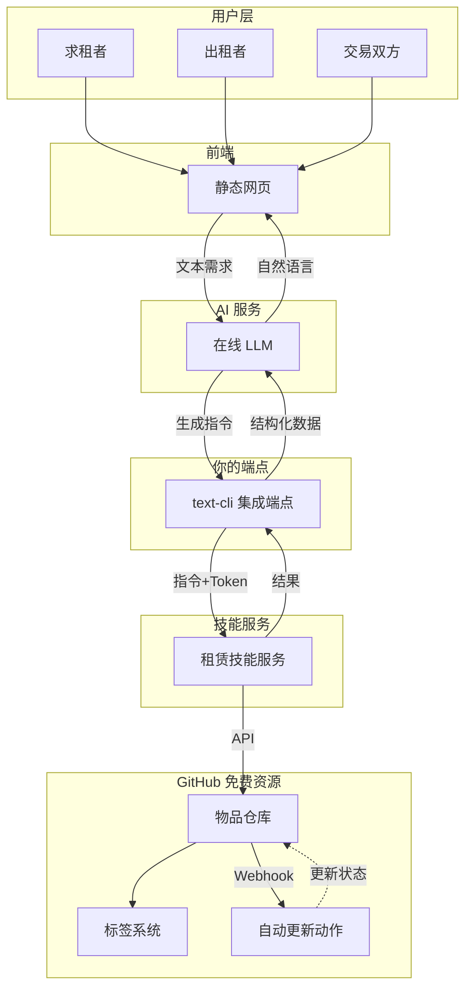
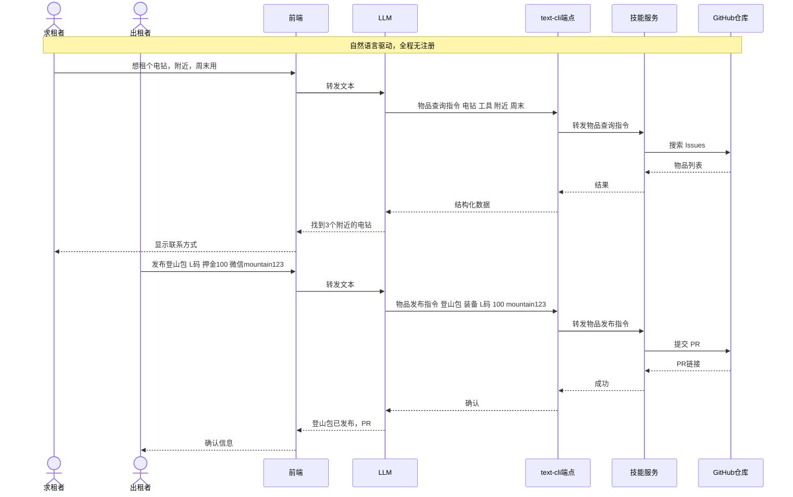
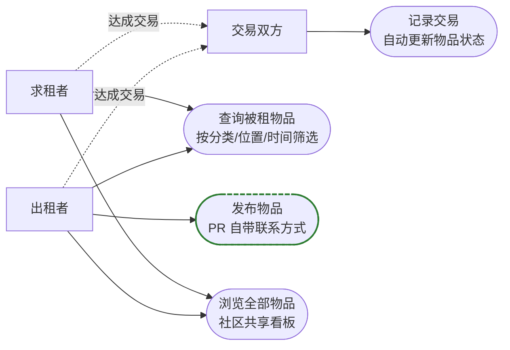

# 🌍 开源租赁平台 · 人人可部署的共享网络

> 一个**完全去中心化、零成本、无注册**的租赁平台。  
> 每个人都可以用一句话发布闲置物品或寻找所需，  
> 所有记录公开透明地存储在 GitHub 上，  
> 而你只需**部署一个 text-cli 端点**，再接入一个**在线 LLM** 即可运行整个社区。

---

## ✨ 为什么我们要做这件事？

世界上有太多闲置物品，也有太多短期需要物品的人。我们想创造一个**完全无需服务器成本、无需用户系统、任何人立即就能参与**的共享网络。  

这里的核心理念很简单：

- 🌱 **真正的零成本** – 利用 Cloudflare 免费边缘计算 + GitHub 免费仓库，你部署的端点自己掌控，永不收费。  
- 🔓 **无需注册** – 出租者发布物品时，联系方式就写在提交的 PR 里。求租者看到直接联系，无需平台账号。  
- 🤖 **AI 原生驱动** – 用户用自然语言说出需求，AI Agent 转译成 `text-cli` 指令，自动完成查询、发布、交易。  
- 📦 **万物可租** – 不限于房屋，任何“被租物品”都可以：工具、书籍、相机、空间、技能时间……  
- 🕸️ **去中心化社区** – 每个社区、城市、兴趣组都可以部署自己的端点，形成无数个互联的小宇宙。  
- 🫂 **完全透明** – 所有物品信息、交易记录都以 Issue/PR 形式公开存在 GitHub 上，可查可审计。

---

## 🧩 系统架构

整个平台由三部分组成：**前端界面**、**你部署的 text-cli 集成端点**、**一个 LLM 服务**。这三者全部可以运行在免费服务上。

> **关键点**：集成端点 `Endpoint` 是你自己部署的，你完全掌控数据流向；AI 部分只需要一个支持 API 的 LLM（哪怕是免费的），它会负责把用户的话翻译成 `text-cli` 指令。

---

## 🚀 使用流程

整个交易过程用自然语言驱动，无需任何手动操作 GitHub。

> **备注：真实 text-cli 指令格式**  
> - 图中“物品查询指令 电钻 工具 附近 周末”实际对应  
>   `指令:租赁;物品查询,电钻,工具,附近,周末`  
> - 图中“物品发布指令 登山包 装备 L码 100 mountain123”实际对应  
>   `指令:租赁;物品发布,登山包,装备,L码,100,mountain123`  
> - 其他场景同理，均以 `指令:租赁;动作,参数1,参数2,...` 的形式传递。

---

## 📦 平台功能

**核心特色**：
- 发布物品只需一句话，AI 自动填写结构化信息并提交 PR（包含联系方式），**完全不需要注册登录**。
- 查询支持“附近、本月、免费”等自然语言筛选，LLM 会提取参数精准匹配。
- 交易达成后，双方说一句“记录这笔交易”，系统自动创建 Issue 并通过 GitHub Actions 更新物品状态（可租→已租）。

---

## 🧠 你只需要部署这些

这个平台的设计哲学是：**极低的个人运营成本，极高的社区自主性**。

### 你需要准备的三样东西：

| 组件 | 如何获得 | 费用 |
|------|---------|------|
| **1. text-cli 集成端点** | 部署在 Cloudflare Workers（免费） 或 你自己的服务器（Docker） | 免费 / 极低 |
| **2. 一个 LLM API** | OpenAI、DeepSeek、Groq、或者本地 LLaMA.cpp 服务 | 可免费（如 Groq 提供免费额度）或少量成本 |
| **3. 前端界面** | 我们提供的静态网页模板，部署到 Cloudflare Pages | 免费 |

**部署步骤（约 10 分钟）：**

1. Fork 本仓库，获取前端模板和技能服务代码。
2. 按 text-cli 文档部署集成端点（选择 Workers 版或 Docker 版）。
3. 在端点的 Schema 中注册租赁技能服务（我们也提供了技能服务的 Docker 镜像）。
4. 申请一个 LLM 的 API Key，配置到 Cloudflare Pages 的环境变量中。
5. 设置 GitHub 仓库的 Labels 和 Actions（自动更新物品状态）。

完成后你就拥有了一个**完全自主运作的租赁社区**。

---

## 🤖 AI Agent 是如何工作的？

我们并没有开发一个庞大的 AI 系统。AI 只做一件事：**将用户的自然语言翻译成 text-cli 指令**。

| 用户输入 | LLM 生成的指令 |
|---------|---------------|
| “周末想租个投影仪，最好在朝阳区” | `指令:租赁;物品查询,投影仪,电子设备,朝阳区,周末` |
| “出租我的旧吉他，押金200，微信号 musicfan” | `指令:租赁;物品发布,吉他,乐器,200,musicfan` |
| “我和对方确认租用吉他，租期两周” | `指令:租赁;交易记录,42,2周` |

LLM 的提示词（prompt）我们已经写好并开源，你可以直接使用任何兼容 Chat Completions API 的模型。我们推荐使用支持中文的廉价模型，例如 `deepseek-chat` 或 `gpt-4o-mini`，成本几乎为零。

---

## 🔒 安全与隐私

- **身份去中心化**：平台不存储任何用户账号，出租者与求租者通过 PR 中的联系方式直接沟通。
- **双层 Token**：端点验证 Access Token（防止滥用），但业务 Token（Service Token）由社区内部自行约定，端点不保存，保护技能服务的安全。
- **数据公开透明**：所有物品和交易记录都在 GitHub 公开仓库中，任何人都能审计，防止诈骗。
- **最低权限**：GitHub Token 仅授予必要的读写权限，不使用高权限 Token。

---

## 🛠️ 技术栈与免费额度

| 服务 | 用途 | 免费额度 |
|------|------|---------|
| **Cloudflare Workers** | 部署 text-cli 集成端点 | 10 万请求/天 |
| **Cloudflare Pages** | 托管前端界面 | 无限静态请求 |
| **GitHub** | 存储所有物品、交易、Actions | 公开仓库完全免费 |
| **LLM API** (如 Groq) | 自然语言理解 | 部分提供商有免费额度 |
| **Docker** (可选) | 自建端点 | 自己的服务器 |

**社区运营成本**：近乎为零。任何感兴趣的组织或个人都可以零成本启动一个共享社区。

---

## 🌐 去中心化的未来

我们鼓励社区分裂和重生——这就是去中心化之美。  
- 大学社团可以部署一个校内物品租赁端点。  
- 某个城市的居民可以共享工具、书籍、婴儿车。  
- 爱好者群体可以短期交换昂贵的设备。  

每个端点都可以有自己的物品范围和信任圈，而所有端点基于同一套协议（`text-cli` 指令）互通。你可以编写自己的技能服务，甚至让 AI 帮忙生成新的服务类型（比如“技能交换”、“时间租借”），然后用统一的指令协议接入。

---

## 🤝 贡献

这是一个完全的开源项目，欢迎任何形式的参与：

- **部署你自己的端点**，成为社区的种子用户。
- **改进技能服务**（`github-skill`），让它支持更多 GitHub 操作。
- **优化 LLM 提示词**，让 AI 更准确地理解中文物品需求。
- **编写多语言前端**，服务不同语言的社区。
- **分享故事**，告诉我们你用这个平台出租了什么，租到了什么。

请提交 Issue 或 PR，我们一起让共享变得更简单。

---

## 📜 许可证

MIT License

---

**让闲置流动，让连接发生，从你部署的端点开始。** 🌍